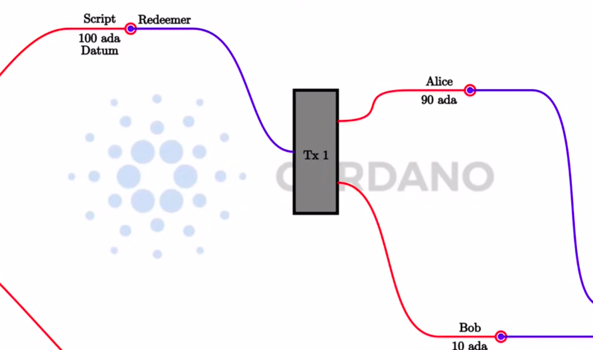

# EUTxO
Extended Unspent Transaction Output

Composed by:
- Script address: which validates transaction
- Datum: data
- Redeemer: action
- Context: composed by inputs, transaction and outputs

Code types:
- Onchain code: stored on blockchain and it validates transaction
- Offchain code: executed on the wallet and creates the transaction