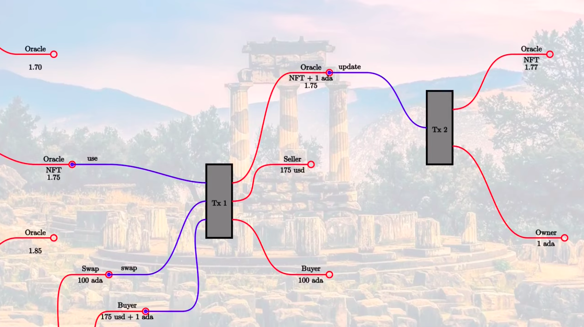

# General
- Everything in a blockchain can't change.
- It's not possible to change a UTXO.
- It's just possible to consume UTXO and produce new ones.

# Oracles
Oracles are represented as UTXO. Correct Oracle can be identified by an specific NFT.
- Datum: Oracle value (i.e. 1.75, 1.77)

## Oracle

### Redeemer: use

Validator: should validate Oracle UTXO consumed including: 
- Input:
    There is an NFT
- Output:
    - This output contains same Oracle address as input
    - NFT is still there
    - Fee is also paid
    - Datum is not changed

### Redeemer: update
- In order to support another operation from Oracle provider: change the data.
- Transaction must be signed by Oracle provider: only can be done by Oracle provider.
- Oracle provider can collect all fees.

Validator: should validate Oracle UTXO consumed including: 
- Input:
    There is an NFT
- Output:
    - This output contains same Oracle address as input
    - NFT is still there
    - Datum is same type

## Swap
Needs access to the Oracle value, using the Oracle UTXO

### Redeemer: swap

Validator: should validate:
- Input:
    There should be the oracle UTXO
    Swap
    Buyer
- Output:
    Seller has the correct USD token value
    Buyer has the correct ADA value

# Notes

## To mint NFTS
To mint several NFTs using same CurrencySymbol with different Token names and values

    import Plutus.Contracts.Currency
    :t mintContract

## To change a contract with error
If we have a contract with error type e, we can change it with an specific type e'

    :t mapError

## Tranform a String into a Text
    pack

## Tranform a Text into a String
    unpack

## Constraints
mustPayToTheScript: creates an Output
mustSpendScriptOutput: creates an Input to this script address

## MapMaybe
    import Data.Maybe
    :t mapMaybe
    f (n :: Int) = if even n then Just (div n 2) else Nothing
    f 8
    f 5
    mapMaybe f [2,4,10,11,13,100]
Result = [1,2,5,50]

## mdebruijne#8476 -> #lesson-6
https://discord.com/channels/826816523368005654/842334723484680192/872517184683921428
> There is no direct connection between Datum and Redeemer. For example in the Give/Grab exercise, the PubKeyHash of the beneficiary is set as Datum by the giver, but the beneficiary doesn't need to set the Redeemer to grab.

https://discord.com/channels/826816523368005654/842334723484680192/872518331251429437
> The Datum can optionally be stored on the blockchain, but only DatumHash is in the LedgerState. You need the PAB to retrieve the Datum from the blockchain and make it available in the Contract.

https://discord.com/channels/826816523368005654/842334723484680192/872600690239897671
> Think of the Cardano blockchain as a two-tier storage. Tier one is the so-called LedgerState and contains the UTxOs and DatumHash. The validating nodes use this tier for phase 1 validation.
>
> The second tier is for archive and auxiliary data. The validating nodes don't have access to this tier during validation.
>
> The Contract is the off-chain component that constructs the transaction. It is the responsibility of the Contract to provide the Datum that matches the DatumHash known in the LedgerState.
>
> The question is, how does the Contract know the Datum? There are two options. The Contract has direct access to the Datum, or the Datum comes from the outside world via IO. In the latter, the PAB functions as a bridge between IO and the Contract.
>
> This outside world can be anything, REST API, SQL DB, filesystem, and the second tier of the Cardano blockchain, which is also considered the outside world. It is possible to store data in this tier by, for example, transaction metadata or optional output Datum.

## PAB
To interact with contracts

https://github.com/input-output-hk/plutus/blob/master/plutus-pab/src/Plutus/PAB/Webserver/API.hs