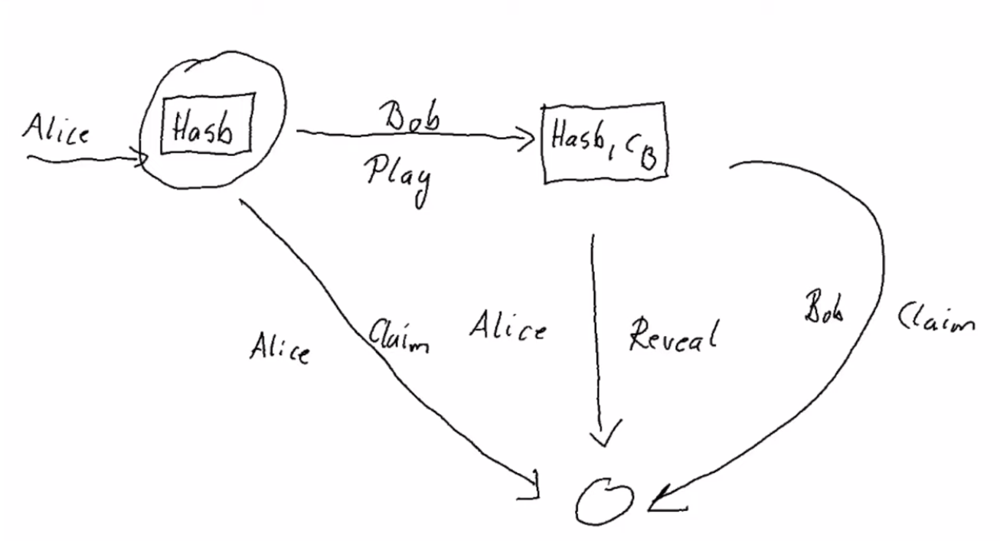

# State machines

Allows to write more concise on chain and off chain code. They run on top of lower level we have seen.

Using State machine, constraints are specified. They can be used in both sides: for check (on chain) and for construction (off chain).

## Structure
- Nodes correspond to states
- Moves correspond to transitions



- State machine will be represented by UTXO sitting at the State maching script address.
- State of the State machine will be the Datum of the UTXO.
- Transition will be a transaction that consumes the current state (this current UTXO), using a redeemer that characterizes the transition and produces a new UTXO at the same address where the Datum reflects the new state.

## Type
State machine has two inputs:
- State: Datum
- Input: Redeemer

```
import Plutus.Contract.StateMachine
:t StateMachine
```

## Constructor
State machine constructor has 4 parameters:

- smTransition :: State s -> i -> Maybe (TxConstraints Void Void, State s)

From one state and an input, produces a new State applying some constraints. State includes: value.

- smFinal :: Bool

If it's a final state, then it's not produced a new UTXO

- smCheck :: s -> i -> ScriptContext -> Bool

Express additional conditions that can't be expressed in TxConstraints (parameter 1)

- smThreadToken :: Maybe ThreadToken

Fulfills the same purpose of having an NFT. Take care of the process of mint and trading NFT in the transitions.
It will check every state (middle and final) for this Token to confirm the correct UTXO. 
This Token will not be visible from Value of the State

# General notes

- It's not possible to use Strings literals to get ByteString in Haskell that is compiled to Plutus code. 

## Off chain code
- Constructs the transaction that will pass checks on on-chain code
- Takes UTXO incomes

## On chain code
- Checks wether a transaction is valid
- Takes entire UTXO

## Find function
According to predicate, find an element and return first

    import Data.List
    :t find
    find even [1 :: Int, 3, 5, 8, 11, 12]